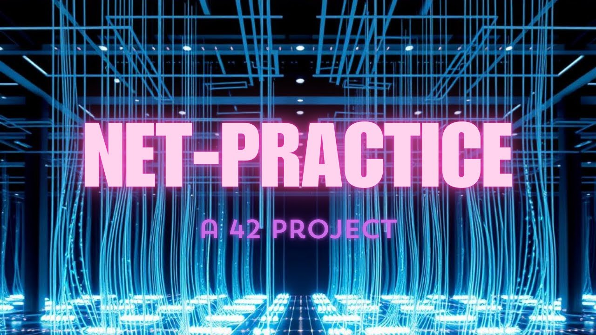


# 🌐 NetPractice — Networking Fundamentals (42 Project)

Welcome to **NetPractice**, an interactive project from **42 School** that helps you learn how computer networks work — one IP, one subnet, and one packet at a time.

This guide walks you through the key networking concepts that you’ll need to understand and apply in this project.

---

## 🧩 What Is an IP?

An **IP (Internet Protocol) address** is a unique numerical label assigned to each device connected to a network.  
It identifies:
1. **The host** (specific device)  
2. **The network** it belongs to  

Think of it like a home address — it tells data where to go on the internet.

---

## 🗂️ Types of IP Addresses

| Type | Description |
|------|--------------|
| **Private IP** | Used within local networks (e.g., 192.168.x.x). Not visible on the internet. |
| **Public IP** | Unique across the internet. Assigned by your ISP. |
| **Static IP** | Manually configured and doesn’t change. |
| **Dynamic IP** | Assigned automatically by DHCP and can change over time. |
| **Loopback IP** | Used for internal testing (127.0.0.1). |

---

## 🎯 Purpose of IP Addresses

IP addresses allow devices to **find** and **communicate** with each other over networks.  
Every email sent, every website visited, and every online message relies on IP addressing to reach the correct destination.

---

## 🌍 IPv4 vs IPv6

| Feature | **IPv4** | **IPv6** |
|----------|-----------|-----------|
| **Format** | 32-bit (e.g., `192.168.1.1`) | 128-bit (e.g., `2001:0db8:85a3::8a2e:0370:7334`) |
| **Total Addresses** | ~4.3 billion | ~340 undecillion |
| **Notation** | Dotted decimal | Hexadecimal with colons |
| **Purpose** | Traditional system, still widely used | Created to solve IPv4 exhaustion and improve efficiency |

---

## 🖧 What Is TCP/IP?

**TCP/IP (Transmission Control Protocol / Internet Protocol)** is the fundamental suite of communication protocols used for the Internet and most networks.

- **IP** defines *where* data goes (addressing and routing).  
- **TCP** defines *how* data is transmitted reliably between systems.

Together, they make sure your data reaches the right place **accurately and in order**.

---

## ⚙️ Difference Between TCP and IP

| Concept | **TCP** | **IP** |
|----------|----------|--------|
| **Function** | Ensures reliable communication and correct order of data packets. | Handles addressing and routing of packets across networks. |
| **Level** | Transport layer | Network layer |
| **Reliability** | Reliable (checks for errors and retransmits lost packets) | Unreliable (best effort delivery) |

---

## 🔄 How TCP/IP Works

1. **Application Layer** – Your app (like a browser) creates data to send.  
2. **Transport Layer (TCP)** – Splits data into segments, adds port numbers, and ensures reliability.  
3. **Internet Layer (IP)** – Adds IP addresses to define source and destination.  
4. **Network Access Layer** – Converts data into bits and sends it physically through cables or Wi-Fi.  
5. **Destination Device** – Reassembles and reads the data in the correct order.

---

## 🔌 What Is a Switch?

A **switch** connects multiple devices on the same local network (LAN) and forwards data only to the device that needs it.  
It operates on **Layer 2 (Data Link Layer)** using **MAC addresses**.

Think of it like a traffic controller inside your local network.

---

## 🚦 What Is a Router?

A **router** connects multiple networks together (like your home network and the internet).  
It operates on **Layer 3 (Network Layer)** and uses **IP addresses** to determine the best path for data packets.

---

## 🛰️ How a Router Works

1. Receives data packets from one network.  
2. Reads their **destination IP address**.  
3. Uses its **routing table** to decide the best path.  
4. Forwards the packets to the next hop (another router or the destination device).

Routers make the internet possible by guiding billions of packets every second.

---

## 📡 Modem vs Router

| Feature | **Modem** | **Router** |
|----------|------------|-------------|
| **Purpose** | Connects your network to your ISP (Internet Service Provider). | Distributes the internet connection to multiple devices. |
| **Function** | Converts signals between your ISP and your network. | Directs traffic between your devices and external networks. |
| **Typical Connection** | One-to-one (ISP ↔ Modem) | One-to-many (Router ↔ Devices) |

---

## 🌀 What Is a Loopback Address?

The **loopback address** (typically `127.0.0.1` for IPv4 or `::1` for IPv6) is used to test network functionality **within your own computer**.  
It never leaves the machine — perfect for testing servers locally.

---

## 🧮 What Is a Subnet?

A **subnet (subnetwork)** divides a large network into smaller, more manageable parts.  
This improves performance, security, and efficiency by reducing congestion and limiting broadcast traffic.

Example:  
`192.168.1.0/24` → 256 possible addresses within that subnet.

---

## 🧠 How to Calculate a Subnet Mask (Step by Step)

Subnetting may look intimidating at first, but it’s actually a logical process once you understand how IP addresses and binary math work together.

Let’s break it down thoroughly.

---

### 🧩 Step 1. Understand the IP and CIDR Notation

Example:  

```
192.168.1.10/26
```

- `192.168.1.10` → The IP address  
- `/26` → The **CIDR prefix**, meaning the **first 26 bits** are reserved for the **network** part, and the remaining bits (32 - 26 = 6 bits) are for **hosts**.

---

### 💡 Step 2. Write the Subnet Mask in Binary

Start with 32 bits (4 octets, 8 bits each):


---
```
11111111.11111111.11111111.11000000
```

Why? Because `/26` means the first 26 bits are **1** (network bits), and the remaining 6 are **0** (host bits).

---

### 🔢 Step 3. Convert the Binary to Decimal

Now convert each octet (group of 8 bits) into its decimal equivalent:

| Binary | Decimal |
|--------|----------|
| 11111111 | 255 |
| 11111111 | 255 |
| 11111111 | 255 |
| 11000000 | 192 |

✅ **Subnet mask:** `255.255.255.192`

---

### 📏 Step 4. Find the Block Size

To find how large each subnet is:
Block size = 256 - (last octet value in subnet mask)


For `/26` → last octet = 192  
→ `256 - 192 = 64`

So, each subnet covers **64 IP addresses**.

---

### 📍 Step 5. Find Subnet Ranges

Since each block is 64 addresses wide, start from 0 and add 64 each time:

| Subnet | Range | Usable Hosts | Broadcast |
|---------|--------|---------------|------------|
| 1 | 192.168.1.0 → 192.168.1.63 | 192.168.1.1 → 192.168.1.62 | 192.168.1.63 |
| 2 | 192.168.1.64 → 192.168.1.127 | 192.168.1.65 → 192.168.1.126 | 192.168.1.127 |
| 3 | 192.168.1.128 → 192.168.1.191 | 192.168.1.129 → 192.168.1.190 | 192.168.1.191 |
| 4 | 192.168.1.192 → 192.168.1.255 | 192.168.1.193 → 192.168.1.254 | 192.168.1.255 |

Now find where your IP (`192.168.1.10`) fits:

→ It belongs to **Subnet 1** (`192.168.1.0/26`).

✅ **Network Address:** 192.168.1.0  
✅ **First Usable:** 192.168.1.1  
✅ **Last Usable:** 192.168.1.62  
✅ **Broadcast:** 192.168.1.63  
✅ **Usable Hosts:** 2⁶ − 2 = **62 hosts**

---

### 🧮 Step 6. General Formula for Subnet Calculations

| Parameter | Formula | Example (/26) |
|------------|----------|---------------|
| **Subnet Mask** | Derived from prefix | 255.255.255.192 |
| **Network Bits** | Equal to prefix | 26 bits |
| **Host Bits** | 32 − prefix | 6 bits |
| **Hosts per Subnet** | (2^host_bits) − 2 | (2⁶ − 2) = 62 |
| **Number of Subnets (Class C)** | 2^(prefix − 24) | 2^(26 − 24) = 4 |
| **Block Size** | 256 − (last mask octet) | 64 |

---

### 🔁 Step 7. More Examples

#### Example 1: `10.0.0.5/30`
- Subnet mask: `/30` → `255.255.255.252`
- Host bits: `32 − 30 = 2`
- Hosts per subnet: `2² − 2 = 2`
- Block size: `256 − 252 = 4`
- Subnet ranges:
  - 10.0.0.0 → 10.0.0.3  
  - Usable: 10.0.0.1 – 10.0.0.2  
  - Broadcast: 10.0.0.3  
  ✅ *Only 2 usable hosts (common in point-to-point links).*

---

#### Example 2: `172.16.50.200/20`
- `/20` → 255.255.240.0
- Host bits: 12 → (2¹² − 2 = 4094 hosts)
- Block size: `256 − 240 = 16`
- Subnets increase by 16 in the **third octet**:
  - 172.16.0.0/20  
  - 172.16.16.0/20  
  - 172.16.32.0/20  
  - 172.16.48.0/20 ← contains our IP
  - Network: 172.16.48.0  
  - Broadcast: 172.16.63.255  
  ✅ *Usable range:* 172.16.48.1 – 172.16.63.254

---

#### Example 3: `192.168.10.75/29`
- `/29` → 255.255.255.248  
- Host bits: 3 → (2³ − 2 = 6 hosts)
- Block size: `256 − 248 = 8`
- Subnets:  
  192.168.10.0, 192.168.10.8, 192.168.10.16, ...
- Our IP (`75`) → falls in `192.168.10.72/29`
  - Network: 192.168.10.72  
  - Usable: 192.168.10.73 – 192.168.10.78  
  - Broadcast: 192.168.10.79  
  ✅ *6 usable hosts per subnet.*

---

### 🧠 Quick Reference Table

| CIDR | Subnet Mask | Hosts/Subnet | Block Size |
|------|--------------|---------------|-------------|
| /24 | 255.255.255.0 | 254 | 1 |
| /25 | 255.255.255.128 | 126 | 128 |
| /26 | 255.255.255.192 | 62 | 64 |
| /27 | 255.255.255.224 | 30 | 32 |
| /28 | 255.255.255.240 | 14 | 16 |
| /29 | 255.255.255.248 | 6 | 8 |
| /30 | 255.255.255.252 | 2 | 4 |

---

## 🚀 Summary

NetPractice helps you **visualize and master** these networking fundamentals by simulating real network configurations.  
By the end, you’ll understand how **data travels**, **networks interconnect**, and **IPs communicate** — all crucial skills for any developer or system engineer.

---

## 🧭 Author

**Project:** NetPractice  
**School:** 42  
**Written by:** *[Your Name]*  
**Date:** *[Month, Year]*  

---


# Levels

## Level_1
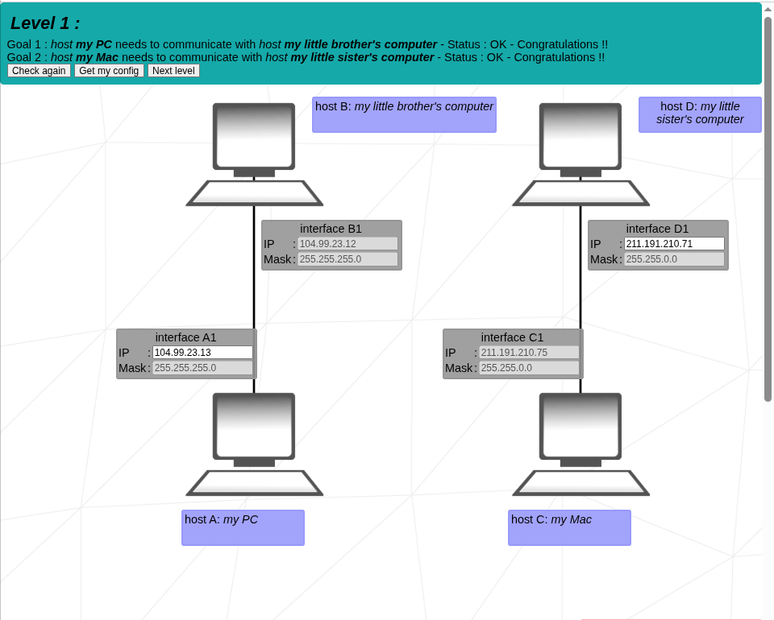
## Level_2
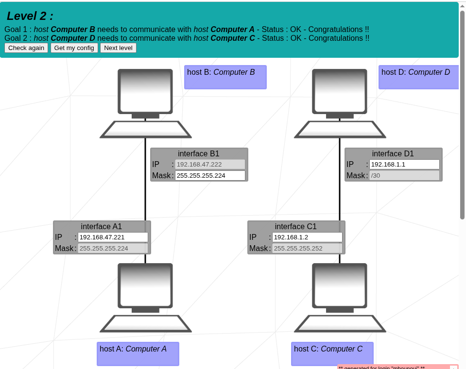
## Level_3
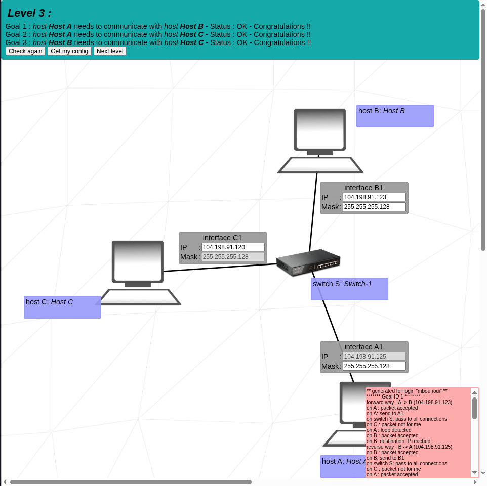
## Level_4
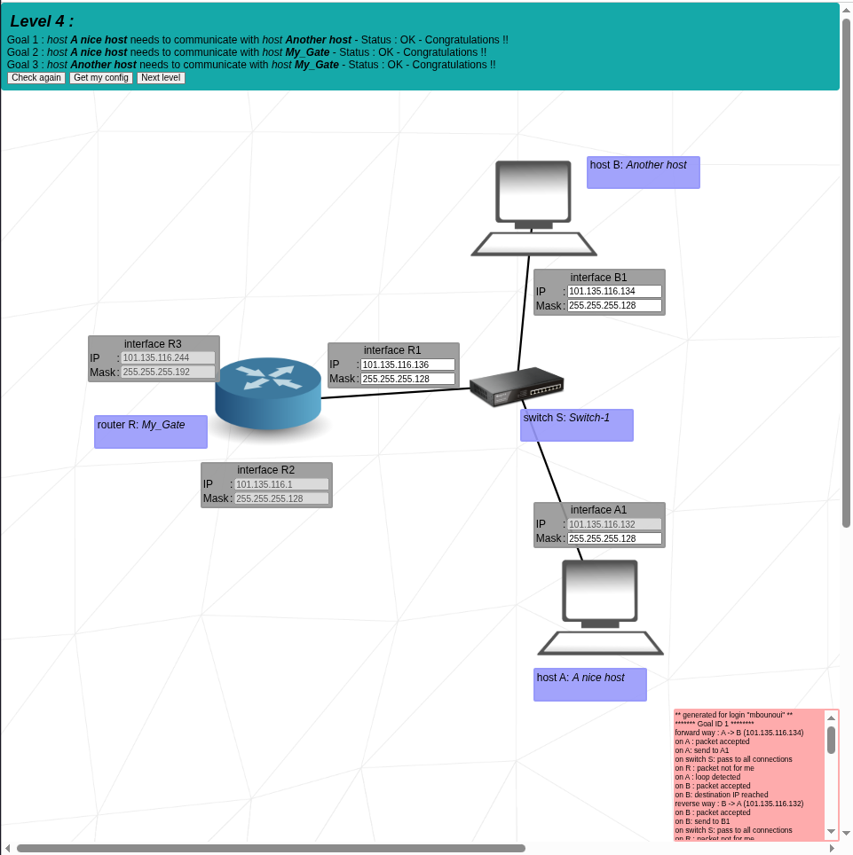
## Level_5
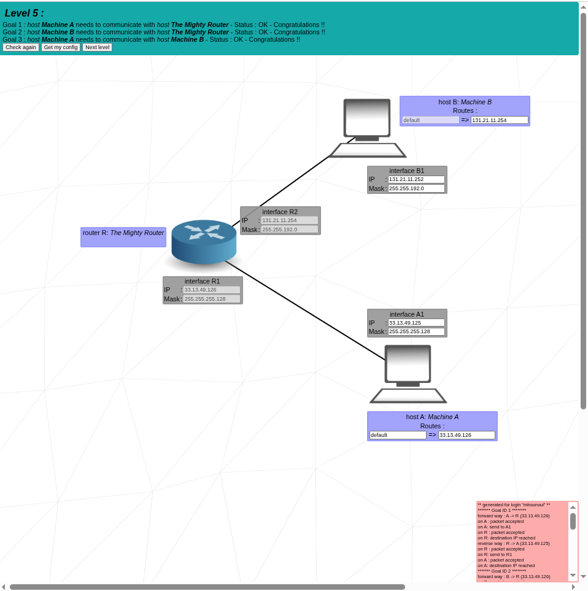
## Level_6
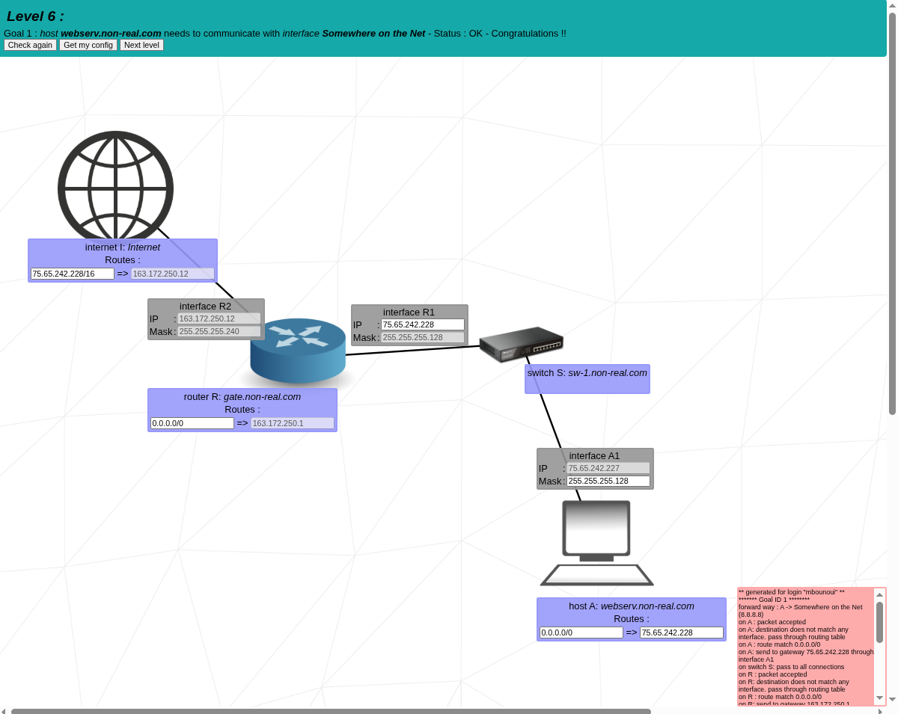
## Level_7
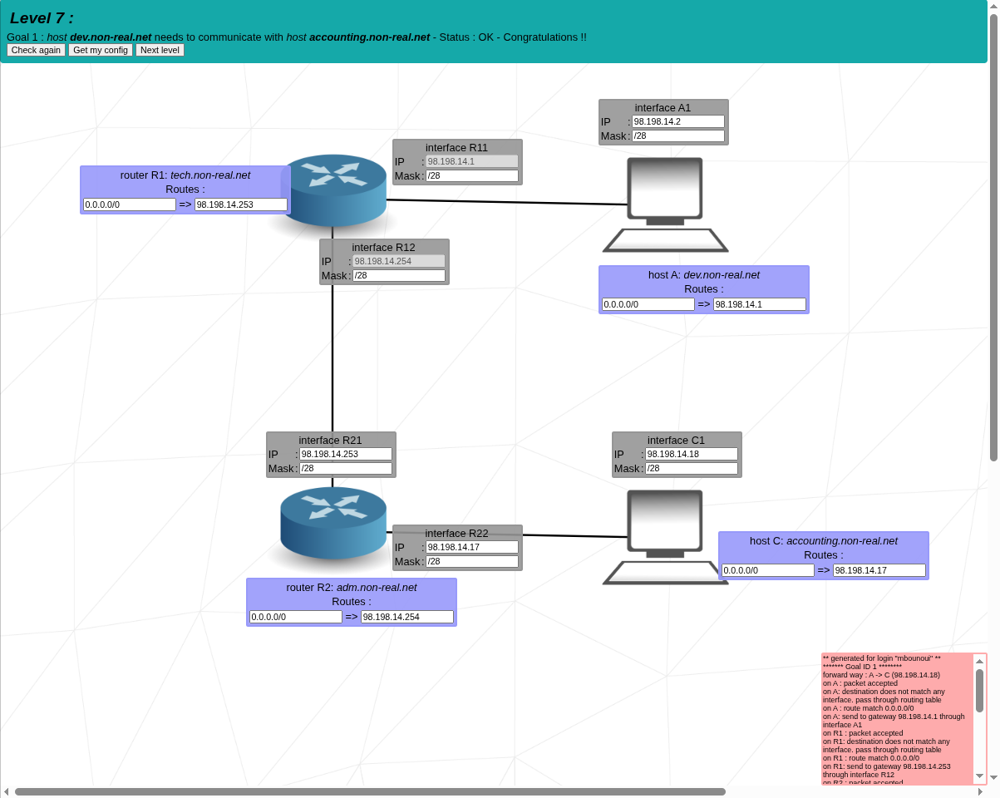
## Level_8
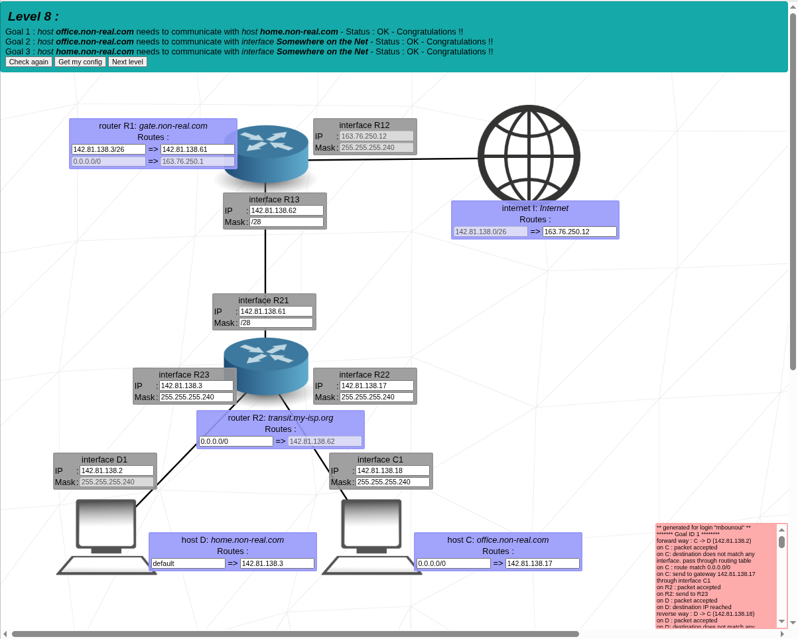
## Level_9
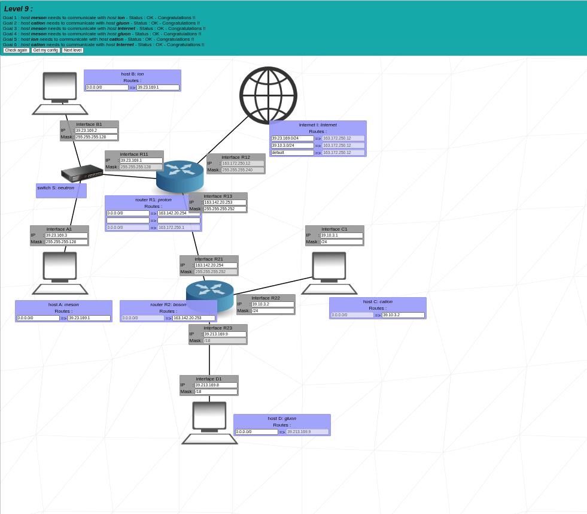
## Level_10
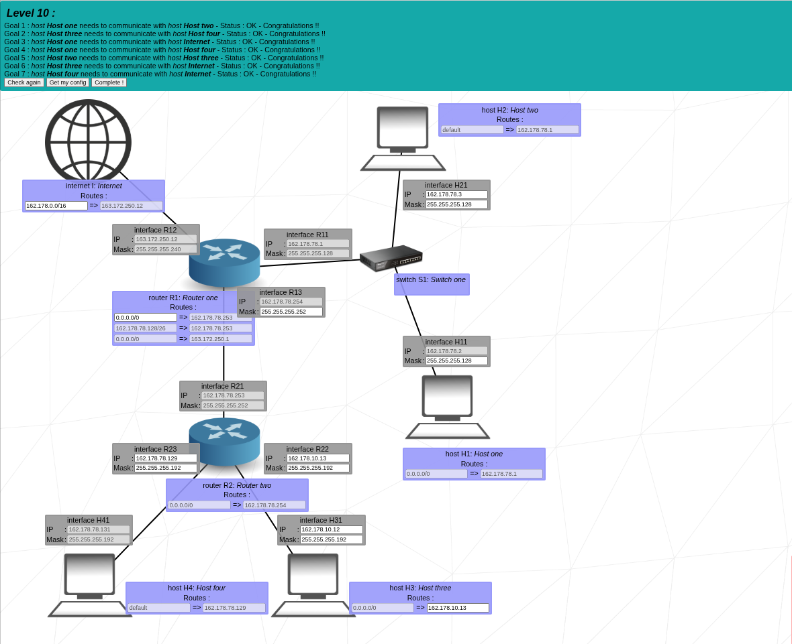
##						GOOD LUCK
